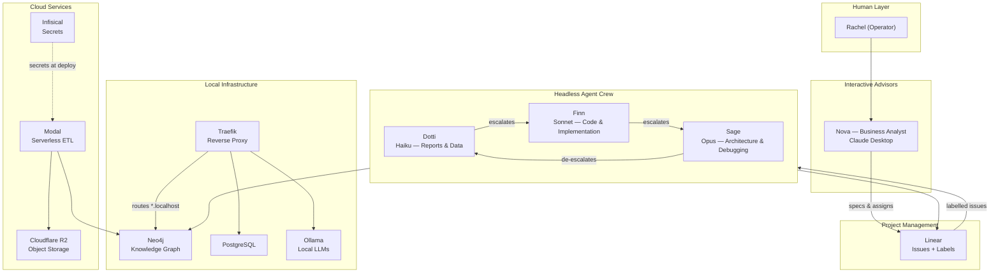

# AI System Architecture Portfolio

A production multi-agent AI system built for [Liflode](https://liflode.com) — a solo consulting practice. This repo documents the architecture, design decisions, and infrastructure behind a local-first AI development environment with tiered autonomous agents, a knowledge graph, and serverless ETL pipelines.

This isn't a tutorial or template — it's a working system I designed, built, and operate daily.

## System Overview



## Key Components

| Component | What It Does | Deep-Dive |
|-----------|-------------|-----------|
| Multi-Agent System | Three-tier autonomous agent crew with intelligent escalation | [Agent System](architecture/agent-system.md) |
| Local AI Infrastructure | Docker Compose stack with 15+ services, Traefik routing | [Infrastructure](architecture/infrastructure.md) |
| Knowledge Graph | Neo4j for graph + vector search, relationship-aware RAG | [Knowledge Graph](architecture/knowledge-graph.md) |
| Serverless ETL | Modal pipelines: R2 → parse → embed → Neo4j/Neon/MotherDuck | [Infrastructure](architecture/infrastructure.md#serverless-etl) |
| Secrets Management | Infisical as single source of truth, deploy-time injection | [Key Decisions](decisions/key-decisions.md#secrets-management) |

## Case Studies

| Case Study | What It Covers |
|-----------|---------------|
| [Tiered Agent Crew](case-studies/tiered-agent-crew.md) | Building an autonomous agent crew with model-matched tiers and label-based escalation |
| [Wilderness Lab](case-studies/wilderness-lab.md) | Multi-agent epistemological experiments — four thinking styles debating in structured protocols |
| [Knowledge Graph RAG](case-studies/knowledge-graph-rag.md) | Hybrid graph + vector retrieval in Neo4j — semantic search with relationship context |
| [Agent Memory](case-studies/agent-memory.md) | Giving agents persistent operational memory with FAISS + SQLite for cross-session learning |

## Design Philosophy

**Local-first, cloud-augmented.** The core development environment runs entirely on a single machine — knowledge graph, LLMs, reverse proxy, databases. Cloud services (Modal, R2, Infisical) handle what local can't: serverless compute, durable storage, and secrets management.

**Right-sized models.** Not every task needs the most powerful model. The agent crew uses tiered models — Haiku for data queries, Sonnet for implementation, Opus for architecture — optimising for cost and latency without sacrificing quality where it matters.

**Decisions over code.** The most valuable part of any system isn't the implementation — it's the reasoning behind it. This portfolio emphasises *why* over *how*. See [Key Decisions](decisions/key-decisions.md).

## Tech Stack

| Category | Tool | Why This One |
|----------|------|-------------|
| Agent Runtime | Claude Code CLI | Native MCP support, autonomous execution, Linear integration |
| LLM Models | Claude Haiku / Sonnet / Opus | Tiered by capability for cost optimisation |
| Knowledge Graph | Neo4j 5 | Graph + vector search in one DB, Cypher query language |
| Reverse Proxy | Traefik v3 | Docker-native, automatic service discovery, `*.localhost` routing |
| ETL Pipeline | Modal | Serverless Python, pay-per-use, GPU access for embeddings |
| Object Storage | Cloudflare R2 | S3-compatible, zero egress fees |
| Secrets | Infisical | Centralised, auditable, machine identity auth |
| Project Management | Linear | API-first, label-based automation, MCP integration |
| Local LLMs | Ollama + Open WebUI | Run models locally for experimentation |
| RAG | AnythingLLM | Connects to Ollama + Neo4j for local retrieval |
| Databases | PostgreSQL, Neon, MotherDuck | Relational (local), relational (cloud), analytics |
| Orchestration | Docker Compose | Single command to start entire stack |

## What I Learned

Building this system taught me more than any course could:

- **Multi-agent coordination is a design problem, not a prompting problem.** The escalation chain works because the handoff protocol is explicit — labels, comments, structured context. Vague delegation produces vague results.

- **Model selection is an engineering decision.** Running everything on the most capable model is wasteful. Matching model capability to task complexity — Haiku for queries, Sonnet for code, Opus for architecture — cut costs significantly while maintaining quality.

- **Graph databases change how you think about data.** Once you model knowledge as nodes and relationships rather than rows and columns, questions like "find similar documents AND their authors AND related topics" become single queries instead of multi-table joins.

- **Local-first doesn't mean isolated.** The Docker stack runs 15+ services on one machine, but the system extends into Modal for compute, R2 for storage, and Linear for coordination. Local-first means *control*, not *limitation*.

- **Architecture decisions compound.** Each ADR forced me to articulate tradeoffs — why Neo4j over Memgraph, why Modal over AWS Lambda, why tiered models over one-size-fits-all. These decisions compound: good early choices made later decisions easier.

## Repository Structure

```
ai-system-portfolio/
├── README.md                       # This file — system overview
├── architecture/
│   ├── agent-system.md             # Multi-agent design deep-dive
│   ├── infrastructure.md           # Docker stack & cloud services
│   └── knowledge-graph.md          # Neo4j design & patterns
├── case-studies/
│   ├── tiered-agent-crew.md        # Building the agent crew
│   ├── wilderness-lab.md           # Multi-agent experiments
│   ├── knowledge-graph-rag.md      # Hybrid graph + vector retrieval
│   └── agent-memory.md             # Persistent agent memory
├── examples/
│   ├── docker-compose.yml          # Sanitised infrastructure config
│   ├── escalation-flow.md          # Real escalation walkthrough
│   └── agent-configs/
│       └── crew-setup.md           # Agent configuration patterns
└── decisions/
    └── key-decisions.md            # Curated architecture decisions
```

## Contact

Built by Rachel Laurie — facilitator, systems thinker, and AI practitioner.
