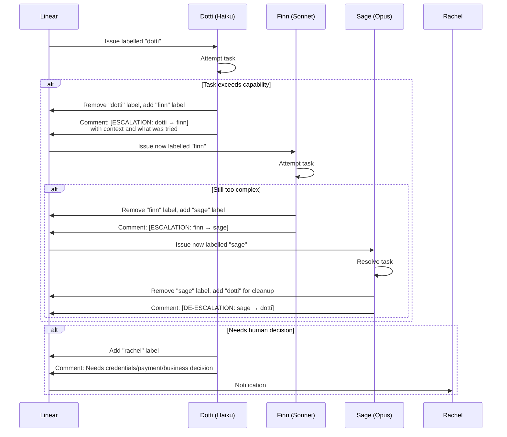

# Multi-Agent System Design

## Overview

The agent system uses a tiered crew of autonomous AI agents, each running a different Claude model matched to their role. A human operator sets direction through an interactive advisor (Nova), which translates business intent into structured Linear issues. The headless crew picks up labelled issues and works autonomously, escalating when tasks exceed their capability.

## Architecture


## Agent Roles

| Agent | Model | Role | Strengths | Limitations |
|-------|-------|------|-----------|-------------|
| **Dotti** | Haiku | Reports, queries, data formatting, admin tasks | Fast, cheap, good at structured output | Struggles with complex logic or multi-step reasoning |
| **Finn** | Sonnet | Code implementation, bug fixes, feature development | Strong coder, good at following specs | Can get stuck on architectural ambiguity |
| **Sage** | Opus | Tech lead, architecture decisions, complex debugging | Deep reasoning, system-level thinking | Slowest and most expensive — reserved for hard problems |

### Why Three Tiers?

The alternative — running everything on the most capable model — is wasteful. Most tasks in a consulting practice are routine: run a query, format a report, update a status. Haiku handles these instantly at minimal cost.

The tiered approach means:
- **80% of tasks** (data, reports, admin) run on the cheapest model
- **15% of tasks** (coding, implementation) run on the mid-tier model
- **5% of tasks** (architecture, debugging) run on the most capable model

This mirrors how human teams work: you don't send the senior architect to update a spreadsheet.

## Escalation Protocol

The escalation chain is the core coordination mechanism. It's intentionally simple — label swapping with structured handoff comments.



### Escalation Rules

1. **Always try first.** Don't escalate speculatively — attempt the task before handing off.
2. **Structured handoff.** Every escalation comment includes: what was tried, what failed, and relevant context.
3. **De-escalation is expected.** After Sage solves the hard part, routine follow-up work flows back down to Dotti.
4. **Human escalation is explicit.** The `rachel` label means "this requires a human decision" — credentials, payments, business calls.

### Why Label-Based?

Labels were chosen over more complex orchestration (message queues, custom APIs) because:
- **Linear already exists** in the workflow — no new tool to adopt
- **Visibility** — anyone can see the current state of any task
- **Auditability** — the label history shows exactly who handled what
- **Simplicity** — a label swap is an atomic operation with no failure modes

## Crew Execution

The agents run via PowerShell commands that process all issues matching their label:

```
crew              # Run all agents in sequence: dotti → finn → sage
dotti             # Run only Dotti on issues labelled "dotti"
finn              # Run only Finn on issues labelled "finn"
sage              # Run only Sage on issues labelled "sage"
crew-metrics      # View escalation statistics
```

Each agent invocation:
1. Queries Linear for issues with its label
2. Processes each issue with its assigned model
3. Updates the issue (comments, status changes, label swaps)
4. Exits when all matching issues are processed

## MCP Integration

Agents connect to external services through the Model Context Protocol (MCP), giving them tool access without custom API code:

| MCP Server | What It Provides |
|------------|-----------------|
| Linear | Issue management, label operations, project queries |
| Neo4j | Knowledge graph queries, entity creation, relationship traversal |
| Fibery | Business data, project tracking, CRM |
| Zotero | Research paper management, citation queries |

MCP means agents can query the knowledge graph, check research papers, and update project management — all through the same standardised interface.

## Cost Optimisation

The tiered model approach produces measurable savings:

| Scenario | Model | Relative Cost |
|----------|-------|--------------|
| All tasks on Opus | Opus | 100% (baseline) |
| All tasks on Sonnet | Sonnet | ~33% |
| Tiered (80/15/5 split) | Mixed | ~25% |

The tiered approach costs roughly a quarter of running everything on the most capable model, with negligible quality impact on routine tasks.

## Design Decisions

**Why not a framework like CrewAI or AutoGen?**

The current system uses Claude Code CLI directly — no orchestration framework. This was a deliberate choice:
- Frameworks add abstraction over an interface (LLM calls) that's already simple
- Linear provides the coordination layer (issue assignment, status tracking)
- The escalation protocol is ~20 lines of logic, not a framework-scale problem
- Frameworks are still being evaluated for the multi-model "AI Council" pattern (see [Key Decisions](../decisions/key-decisions.md#multi-agent-architecture))

**Why Claude Code CLI over other agent runners?**

- Native MCP support — agents get tool access without custom integrations
- Autonomous execution — can run headlessly with `--print` mode
- Built-in conversation management — no need to build context windows
- Direct Linear integration — the project management tool is a first-class MCP server
