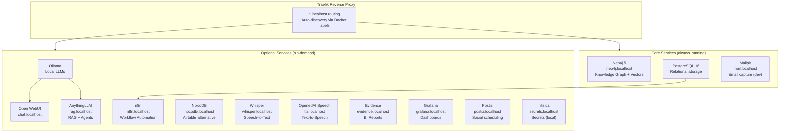
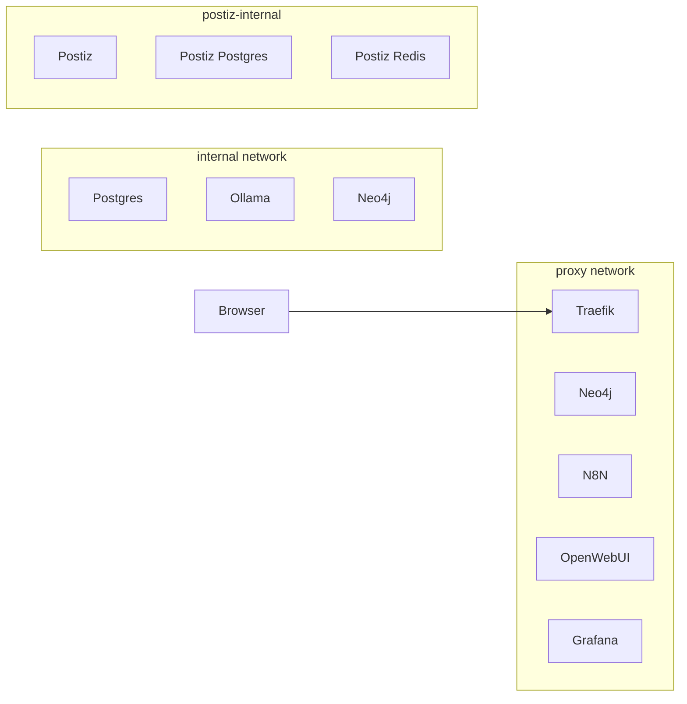
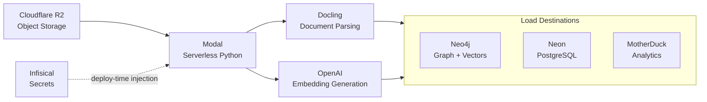

# Infrastructure Design

## Overview

The development environment runs as a Docker Compose stack on a single Windows machine. Traefik provides automatic reverse proxy routing so every service is accessible at `*.localhost`. The stack is split into core services (always running) and optional services (started on demand), keeping resource usage low during daily work.

Cloud services extend the local stack for capabilities that don't make sense to self-host: serverless compute, durable object storage, and secrets management.

## Local Stack Architecture



## Core vs Optional Split

The key design decision: not every service needs to run all the time.

```bash
# Start core services only (~200MB RAM)
docker compose up -d

# Start everything (~2GB+ RAM)
docker compose --profile optional up -d

# Start one specific optional service
docker compose up -d ollama
```

| Tier | Services | When Running |
|------|----------|-------------|
| **Core** | Traefik, Neo4j, PostgreSQL, Mailpit | Always — these support daily agent work |
| **Optional** | Ollama, Open WebUI, AnythingLLM, n8n, NocoDB, Whisper, TTS, Evidence, Grafana, Postiz, Infisical | On-demand — started for specific tasks |

### Why This Split?

- **Neo4j** is core because agents query the knowledge graph constantly
- **PostgreSQL** is core because n8n and NocoDB depend on it (even when those are optional, the data persists)
- **Ollama** is optional because local LLM inference is memory-hungry and only needed for experiments
- **Mailpit** is core because workflow automations need an email sink during development

## Traefik Routing

Traefik discovers services automatically through Docker labels — no manual configuration files:

```yaml
labels:
  - "traefik.enable=true"
  - "traefik.http.routers.neo4j.rule=Host(`neo4j.localhost`)"
  - "traefik.http.services.neo4j.loadbalancer.server.port=7474"
```

Every service gets a memorable URL:

| Service | URL |
|---------|-----|
| Neo4j Browser | `neo4j.localhost` |
| n8n | `n8n.localhost` |
| Open WebUI | `chat.localhost` |
| AnythingLLM | `rag.localhost` |
| Grafana | `grafana.localhost` |
| Mailpit | `mail.localhost` |
| Whisper | `whisper.localhost` |

No port numbers to remember. No conflicts. Adding a new service is one label.

## Networking



Three networks isolate traffic:
- **proxy** — services that need external access (via Traefik)
- **internal** — backend services that communicate with each other
- **postiz-internal** — Postiz and its dedicated database/cache (isolated from main stack)

Services on `internal` can talk to each other but aren't exposed through Traefik unless they also join `proxy`.

## Serverless ETL

For workloads that need more compute than a laptop provides — document parsing, embedding generation — the system extends into the cloud via Modal.



### Pipeline Functions

| Function | Purpose |
|----------|---------|
| `read_r2_file` | Read source documents from R2 buckets |
| `parse_document` | Extract text via Docling (handles PDF, DOCX, etc.) |
| `generate_embeddings` | Create vector embeddings via OpenAI |
| `load_neo4j` | Write nodes + vectors to knowledge graph |
| `load_neon` | Write to cloud PostgreSQL |
| `load_motherduck` | Write to analytics warehouse |
| `orchestrate_etl` | Coordinate the full pipeline |

### Why Modal?

| Factor | Modal | AWS Lambda | Self-hosted |
|--------|-------|-----------|-------------|
| Deployment | `modal deploy main.py` | CloudFormation/SAM | Kubernetes/Docker |
| GPU access | Native | Requires Bedrock | Manual setup |
| Pricing | Pay-per-second | Pay-per-invocation | Always-on costs |
| Python DX | First-class | Runtime packaging | Full control |
| Cold starts | ~2s | Variable | None |

Modal was chosen because the ETL pipeline runs infrequently (batch processing, not real-time) and sometimes needs GPU for larger embedding models. Pay-per-second pricing means zero cost when idle.

## Secrets Management

All credentials are centralised in Infisical (EU instance) and injected at deploy time:

```
1Password (master) → Infisical (centralised) → Modal (deploy-time)
                                              → Docker Compose (.env)
                                              → GitHub Actions (CI/CD)
```

This means:
- **One place to rotate** any credential
- **Audit log** of who accessed what
- **Machine identities** for automated access (no personal tokens in scripts)
- **Environment separation** ready for dev/staging/prod

See [Key Decisions](../decisions/key-decisions.md#secrets-management) for the full rationale.

## Design Principles

### Local-First

The core principle: everything that *can* run locally *does* run locally.

- **Control** — no vendor can deprecate my development environment
- **Speed** — local Neo4j queries are sub-millisecond, no network round-trips
- **Cost** — most services are free to self-host
- **Privacy** — sensitive data never leaves the machine unless explicitly sent

### Cloud for What Local Can't Do

Some things don't make sense locally:
- **Serverless compute** — GPU-accelerated embedding generation on a laptop is impractical
- **Durable storage** — R2 provides object storage that survives machine failures
- **Secrets management** — Infisical provides audit trails and machine identities that a `.env` file can't
- **Project management** — Linear's collaboration features need cloud hosting

### Profile-Based Resource Management

The Docker Compose `profiles` feature is key to running 15+ services on a single machine:

```yaml
# Optional services don't start by default
services:
  ollama:
    profiles: ["optional"]
    # ...
```

This means `docker compose up -d` starts only what's needed (~200MB RAM), and heavy services like Ollama (which loads multi-GB models into memory) only run when explicitly requested.
