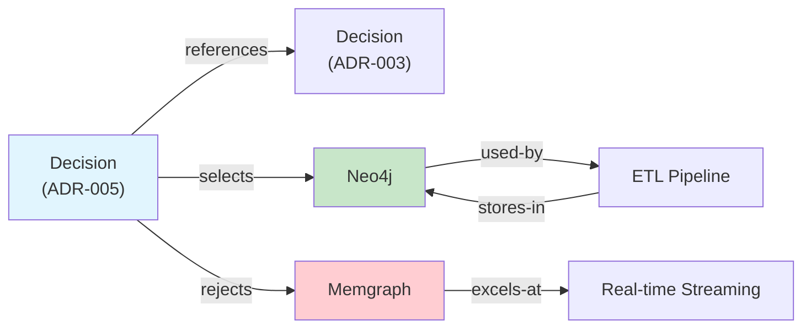
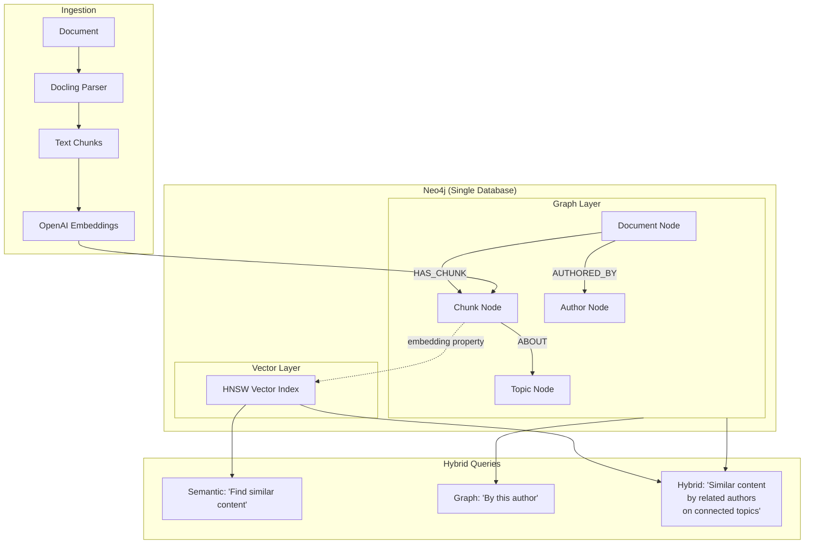
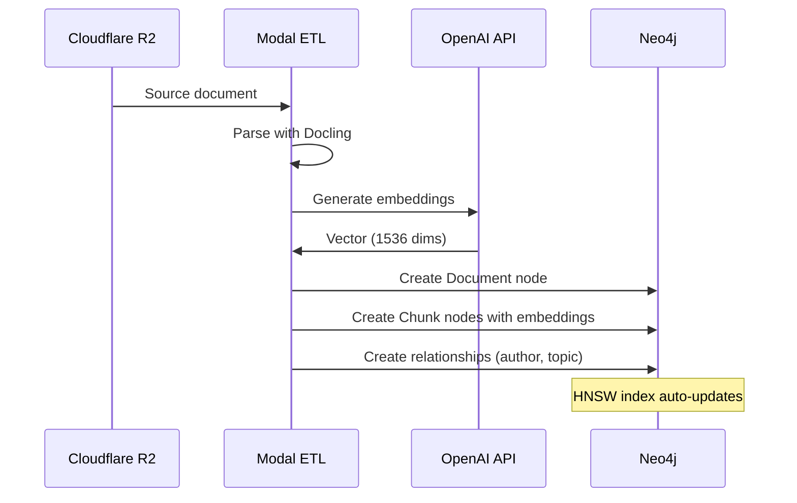

# Knowledge Graph Design

## Overview

The knowledge graph is built on Neo4j 5, serving as both a traditional graph database (entities and relationships) and a vector store (embeddings for semantic search). This dual role eliminates the need for a separate vector database — queries can combine graph traversal with semantic similarity in a single Cypher statement.

## Why a Graph?

The core data in a consulting practice is *relational* — people connect to organisations, decisions reference prior decisions, research papers cite each other, projects depend on technologies. A relational database can model this with join tables, but the queries become increasingly complex as relationship depth grows.



In a relational database, "find all technologies selected by decisions that reference ADR-003" requires multiple joins. In Cypher:

```cypher
MATCH (d:Decision)-[:REFERENCES]->(prior:Decision {id: 'ADR-003'})
MATCH (d)-[:SELECTS]->(tech:Technology)
RETURN tech.name, d.title
```

## Graph + Vector Architecture



### Why Not a Separate Vector Database?

| Approach | Pros | Cons |
|----------|------|------|
| **Neo4j + pgvector (Neon)** | Best-of-breed for each | Two databases, data sync needed, no cross-DB queries |
| **Neo4j only** | Graph + vector in one query, single data model | Neo4j vector search is newer than dedicated vector DBs |
| **Pinecone / Weaviate** | Purpose-built for vectors | Another service to manage, no graph relationships |

The deciding factor: **hybrid queries**. "Find documents similar to X that were authored by people connected to Y" is one Cypher query with Neo4j vectors. With separate databases, it's multiple round-trips and application-level joining.

## Vector Search Details

Neo4j 5.11+ supports native vector indexes using HNSW (Hierarchical Navigable Small World) algorithm:

| Feature | Value |
|---------|-------|
| Index type | HNSW |
| Max dimensions | 4096 |
| Similarity metrics | Cosine, Euclidean |
| Index creation | `CREATE VECTOR INDEX ...` |
| Query function | `db.index.vector.queryNodes()` |

### Hybrid Query Example

```cypher
// Find chunks semantically similar to a query,
// then traverse the graph for context
CALL db.index.vector.queryNodes('chunk_embeddings', 10, $queryVector)
YIELD node AS chunk, score

MATCH (doc:Document)-[:HAS_CHUNK]->(chunk)
MATCH (doc)-[:AUTHORED_BY]->(author:Person)
OPTIONAL MATCH (doc)-[:ABOUT]->(topic:Topic)

RETURN chunk.text, score, doc.title, author.name,
       collect(DISTINCT topic.name) AS topics
ORDER BY score DESC
```

This single query:
1. Finds the 10 most semantically similar chunks (vector search)
2. Traverses to parent documents (graph)
3. Finds authors (graph)
4. Collects topics (graph)
5. Returns enriched results with full context

## Schema Design Principles

### Constraints

All constraints use `IF NOT EXISTS` to make schema creation idempotent:

```cypher
CREATE CONSTRAINT decision_id IF NOT EXISTS
FOR (d:Decision) REQUIRE d.id IS UNIQUE;

CREATE CONSTRAINT technology_name IF NOT EXISTS
FOR (t:Technology) REQUIRE t.name IS UNIQUE;
```

### Node Labels

| Label | Purpose | Key Properties |
|-------|---------|---------------|
| `Document` | Ingested files (PDF, DOCX, etc.) | `title`, `source`, `created` |
| `Chunk` | Text segments with embeddings | `text`, `embedding`, `position` |
| `Decision` | Architecture decisions (ADRs) | `id`, `title`, `status`, `date` |
| `Technology` | Tools, frameworks, services | `name`, `category` |
| `Person` | People (authors, contacts) | `name`, `role` |
| `Topic` | Subject areas | `name` |

### Relationship Types

| Relationship | From | To | Meaning |
|-------------|------|-----|---------|
| `HAS_CHUNK` | Document | Chunk | Document contains this text segment |
| `AUTHORED_BY` | Document | Person | Written by |
| `ABOUT` | Chunk/Document | Topic | Content relates to this subject |
| `SELECTS` | Decision | Technology | Decision chose this tool |
| `REJECTS` | Decision | Technology | Decision ruled this out |
| `REFERENCES` | Decision | Decision | Builds on prior decision |
| `USED_BY` | Technology | various | Technology is used in this context |

### Naming Conventions

- **Node labels**: PascalCase (`Document`, `Technology`)
- **Relationship types**: UPPER_SNAKE_CASE (`HAS_CHUNK`, `AUTHORED_BY`)
- **Properties**: camelCase (`createdDate`, `secretKey`)
- **IDs**: kebab-case strings (`adr-005`, `neo4j-knowledge-graph`)

## Data Flow



## Why Neo4j Over Memgraph

Both are graph databases with Cypher support. The evaluation came down to use case fit:

| Factor | Neo4j | Memgraph |
|--------|-------|----------|
| **Best for** | Batch analytics, knowledge graphs | Real-time streaming (Kafka) |
| **Vector search** | Native (5.11+) | Via MAGE extension |
| **APOC procedures** | Full support | N/A |
| **Ecosystem** | Massive (tutorials, integrations) | Growing but smaller |
| **Cloud option** | Aura (free tier) | Memgraph Cloud |
| **AnythingLLM integration** | Supported | Not native |

The system's workload — batch ETL ingestion, read-heavy queries, occasional knowledge graph updates — is exactly Neo4j's sweet spot. Memgraph's advantage (sub-millisecond streaming queries) doesn't apply.

## Retrieval Patterns

### Pattern 1: Semantic Search with Graph Context

Find similar content, then enrich with graph relationships.

Use case: "Find documents related to 'agent orchestration' and show who wrote them."

### Pattern 2: Graph-First, Vector-Filtered

Start with graph traversal, then filter by semantic similarity.

Use case: "Among documents by Author X, find those most similar to this query."

### Pattern 3: Multi-Hop Exploration

Traverse multiple relationship types to discover connected knowledge.

Use case: "What technologies are connected to decisions that reference ADR-003?"

Each pattern leverages the unique advantage of having graph and vector in one database — no cross-system queries, no data sync, no impedance mismatch.
